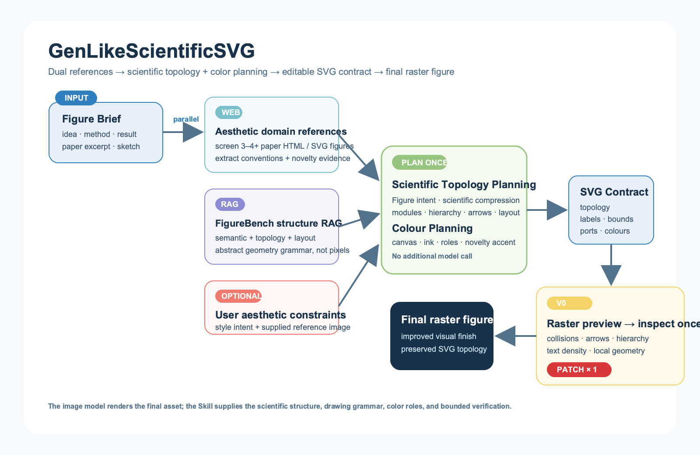
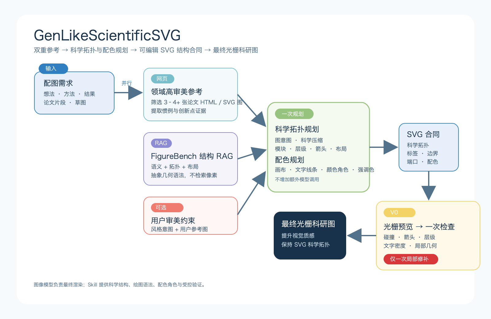

<div align="center">

# GenLikeScientificSVG

### Give AI agents the drawing grammar for better paper figures.

**Dual-reference RAG · curated color systems · editable SVG structure**

[中文说明](./README_ZH.md) · [Workflow](#workflow) · [Install](#install) · [Research note](#research-note)

</div>



## What it is

GenLikeScientificSVG is an agent-agnostic Skill for creating research-paper figures from an idea, methodology, result, paper excerpt, sketch, or reference image. It is designed for Codex, Claude Code, DeepSeek Harness, and other agents that can load a `SKILL.md` workflow with its accompanying files.

It does not replace an image-generation model. It gives that model a structured scientific-figure brief before rendering: evidence from two complementary references, an explicit topology and color plan, and an editable SVG contract that fixes the scientific logic.

## Workflow

The Skill keeps reference gathering parallel and makes one controlled revision only.

| Stage | What is made explicit |
| --- | --- |
| High-aesthetic domain references | Screen at least 3–4 relevant paper HTML/SVG figures for composition, hierarchy, component conventions, whitespace, color relationships, and scientific credibility. This produces drawing conventions and evidence of how the user's method differs from common practice. |
| FigureBench semantic–structural RAG | Retrieve method semantics, figure type, topology, layout, grouping, text density, and abstract geometry grammar. It is not pixel-nearest-neighbour retrieval. |
| Scientific Topology + Color Planning | Compress redundant prose; assign modules, arrows, hierarchy, layout, labels, canvas, ink, semantic color roles, and one restrained novelty accent. This remains one planning pass, not another model call. |
| SVG contract | Lock the scientific topology, module semantics, label bounds, arrow endpoints, z-order, group bounds, and role-to-color assignments in editable SVG. |
| One bounded inspection | Rasterize V0, inspect collisions, arrows, hierarchy, label fit, text density, whitespace, and local geometry; then apply exactly one local SVG patch. |
| Final raster rendering | Let the image model improve assets and visual finish while preserving the patched SVG topology, labels, arrow relations, and color responsibilities. |

### Chinese workflow / 中文流程图



## What the final image model receives

Instead of receiving only a prompt, the final renderer receives a compact scientific-figure contract:

- domain drawing conventions from high-aesthetic paper figures;
- FigureBench semantic–structural summaries, never the full corpus;
- a topology plan that distinguishes common practice from the user's contribution;
- role-based color assignments from an image-free HEX/RGB palette library;
- explicit SVG bounds, labels, ports, arrow directions, hierarchy, and reading order; and
- one local inspection brief that cannot redesign the whole figure.

This is meant to reduce changed relationships, unreadable labels, arbitrary colors, disconnected arrows, and generic slide-like layouts. It is a structural workflow, not a claim that an image model is always correct.

## Install

Clone the repository and retain its directory structure: `SKILL.md` refers to the adjacent `references/`, `scripts/`, and `scientific_figure_rag/` directories.

```bash
git clone https://github.com/LawrenceRiver/genlike-scientific-svg-skill.git
```

| Agent | Loading method |
| --- | --- |
| Codex | Copy or symlink the cloned repository into `~/.codex/skills/genlike-scientific-svg`. |
| Claude Code | Add the repository directory as a project Skill, retaining the directory layout. |
| DeepSeek Harness / other agents | Load `SKILL.md` as the workflow instruction and retain the adjacent files so its references and helper scripts remain available. |

## Color system

The palette RAG stores only grouped HEX/RGB values, color roles, and tags. It does not store palette screenshots, source-image URLs, image paths, or image embeddings.

```bash
python scripts/figurebench_rag.py palettes --planning-json colour-plan.json --top-k 3
```

The planning contract assigns canvas, ink, surfaces, semantic module colors, comparison colors, and at most one novelty accent. See [Palette RAG](./references/palette-rag.md).

## Optional FigureBench RAG

FigureBench is maintainer-local tooling, not an end-user download requirement. The public Skill must not publish raw images, local SQLite indexes, corpus text, or source paths. Read [FigureBench RAG](./references/figurebench-rag.md) before any local indexing or derived-data export.

## Research note

I am a computer-vision student researching scientific paper-figure generation. This project studies how far an agent or VLM can reliably understand a figure brief and control its visual realization when it receives explicit reference evidence, topology, layout, and color constraints—not only a text prompt.

It is an open research tool. Do not use generated conceptual figures as evidence for experimental results without independently verifying the scientific content.

## Repository layout

```text
SKILL.md                   Main workflow
assets/architecture/       Bilingual, editable SVG contracts
assets/showcase/           PNGs rasterized from checked SVG contracts
examples/                  Input, planning, and source records for proof runs
references/                Palette and FigureBench RAG specifications
scientific_figure_rag/     Local semantic–structural and palette retrieval helpers
scripts/                   Indexing, querying, and safe-export commands
tests/                     Retrieval and documentation tests
```
