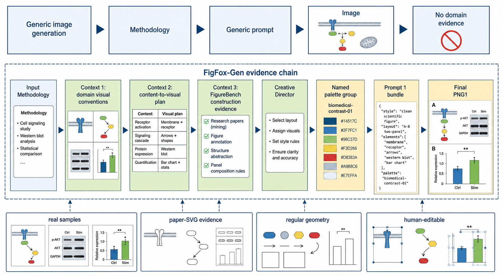
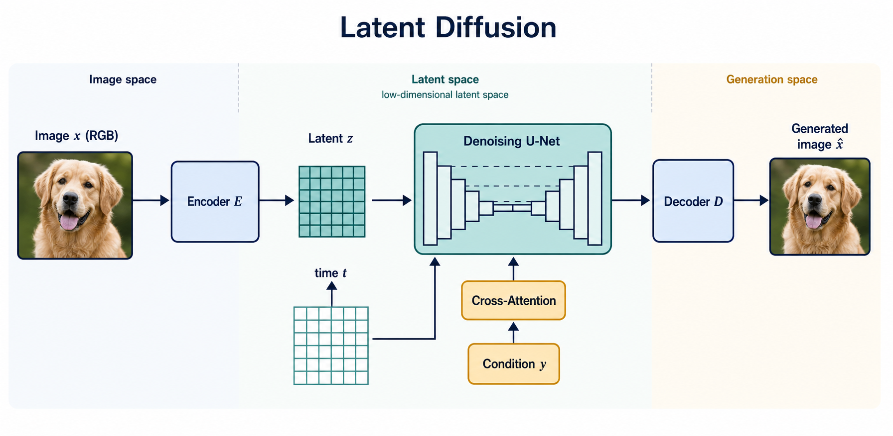
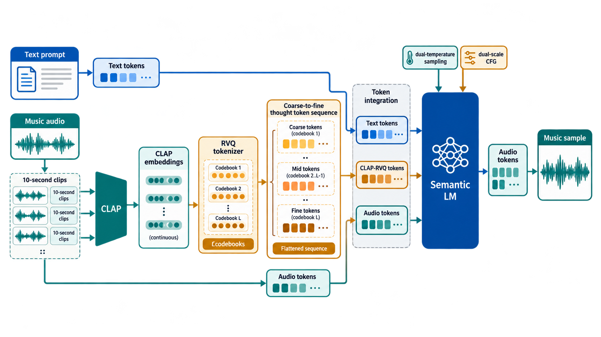
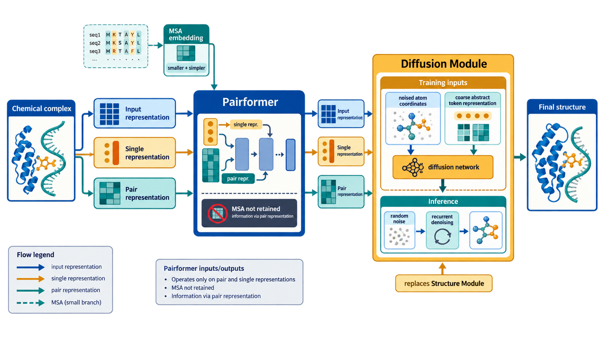

<div align="center">

# FigFox-Gen-skill

### Evidence-guided scientific figures with a human-editable construction plan.

**Domain conventions · human-producible planning · mapped FigureBench crops · named multi-colour palette groups · final PNG1**

[中文说明](./README_ZH.md) · [Why FigFox-Gen](#why-figfox-gen) · [Workflow](#workflow) · [Reference pack](#bundled-reference-pack) · [Installation](#installation)

</div>

FigFox-Gen-skill turns a scientific Methodology and an optional reference image
into one labelled, human-editable-style architecture figure. It performs one
image-generation pass and delivers PNG1 as the final output.

## Generated figure examples

These are four PNG1 outputs made with the current Skill: the first visualizes the
FigFox-Gen methodology itself, followed by the three recorded Methodology cases.
They are examples of the workflow's human-editable-style interpretation, not
copies of the cited papers' figures.

<p align="center">
  
  
</p>
<p align="center">
  
  
</p>

<p align="center">
  <a href="assets/generated-figures/01-figfox-gen-workflow.png">FigFox-Gen workflow</a> ·
  <a href="assets/generated-figures/02-latent-diffusion.png">Latent Diffusion</a> ·
  <a href="assets/generated-figures/03-musicot.png">MusiCoT</a> ·
  <a href="assets/generated-figures/04-alphafold3.png">AlphaFold 3</a>
</p>

## Why FigFox-Gen

The central hook is the evidence chain below: the Methodology determines which
domain visual conventions matter; content-to-visual planning turns those conventions
into human-producible components; FigureBench and scholarly SVG figures contribute
construction evidence; the Creative Director rejects AI-looking treatments; and one
named palette group contributes several compatible colours before the final context is
generated.

<p align="center">
  
</p>

## Installation

```bash
npx skills@latest add LawrenceRiver/FigFox-Gen-skill
```

Then provide a Methodology and, if useful, one reference image. The reference may
guide structure, layout, emphasis, and visibly human-made treatments, but it is not
a colour source.

## Workflow

```text
Methodology + optional reference
  -> Context 1: domain visual conventions
  -> Context 2: content-to-visual plan
  -> Context 3: mapped FigureBench crops + selected palette group + taste
  -> Creative Director prompt -> brief + targeted paper-SVG crops
  -> Prompt 1 with all mapped crops -> PNG1
  -> stop
```

### Context 1: recurring domain visual language

The model identifies the field and screens figure panels from 3–4 scholarly papers,
preferably accessible arXiv SVG/HTML sources and otherwise credible extractable
figures. It compares actual panels and records only recurring, Methodology-relevant
objects, intermediate representations, relationships, drawing treatments, grouping,
professional terminology, and the recurring dominant-colour count. The count is
recorded as `dominant_colour_count` (1–3); source-figure colours themselves are not
copied. One-off treatments remain marked as such.

### Context 2: content-to-visual planning

The Methodology, Context 1, and optional reference are compressed into exact blocks,
labels, relationships, reading order, and a visual treatment for every component.
Treatments must be human-producible: basic geometry, a recurring domain convention,
a deliberate manual drawing, a draw.io-like construction, or a scientifically
necessary real photo crop. Any special visual explains why it is needed and how a
human would make it. Decorative generated-looking elements are rejected.

### Context 3: inspected construction evidence and named palette groups

The model inspects the pixels of at least two distinct bundled FigureBench images,
then continues adaptively until every required geometry, frame, connector, layout
relationship, and special visualization is covered. Useful regions become mapped
crops with a target component, what to borrow, what must change, and why the result
remains human-editable. Complete reference images are not dumped into Prompt 1.

The local palette library stores every named palette group (each `palettes` record is
one group), with multiple role-labelled colours in each group. Each run selects one
group and may use several colours from it;
this is not a single-colour or monochrome rule. If that group lacks a functional
colour, only an evidenced tint, shade, tone, analogous neighbour, compatible neutral,
or controlled contrast may extend it. FigureBench, domain figures, and the user
reference never supply active palette colours. Taste guidance is subordinate to
scientific meaning, user constraints, domain evidence, human editability, and the
selected palette-group lineage. The final figure uses at most three dominant colours
from that group and matches Context 1's observed dominant-colour count; other swatches
remain subordinate neutral, tint, shade, or support roles and cannot become a fourth
dominant hue.

### Creative Director: pre-PNG1 visual ideation

After Contexts 1–3, a Creative Director prompt gives the model one bounded chance to
propose a new visual treatment before PNG1 exists. It does not generate an image or
redesign the figure. If an idea needs a construction not already evidenced, the
model must find a real scholarly paper figure available as SVG or extractable
SVG/HTML, inspect it, and request a targeted crop under
`references/web/crops/creative-director/`. Each crop records its target component,
HTTPS source and evidence URLs, `source_format: "svg"`, `borrow`, `must_change`, and
why the construction remains human-editable. Complete paper figures are never
attached, and sources cannot be invented. If no new treatment is needed, the brief
must say `no_external_svg_needed`.

```bash
python scripts/figure_workflow.py build-creative-director-prompt --run RUN
python scripts/figure_workflow.py validate-creative-director --run RUN
```

### Prompt 1 and final PNG1

Prompt 1 contains the Methodology, Contexts 1–3, the Creative Director brief, the
optional reference, domain crops, every mapped FigureBench crop, and any validated
paper-SVG crops proposed by the Creative Director. The only image-generation pass
creates PNG1. Paper-SVG crops guide only their declared component and are variants;
they do not donate source labels, colours, proportions, or complete compositions.

PNG1 has two absolute anti-AI bans: no module may use a boxed-off upper title band
with a horizontal divider (the screenshot-like title-bar/content-box pattern), and
no sticker-like cutout, clip-art badge, medal, seal, or pasted raster badge may be
inserted. Use inline labels or editable geometry; only a scientifically necessary
real photo can be an explicitly documented special treatment.

The image-generation model receives `prompt-1/prompt.md` and every manifest
attachment once. It must produce one complete labelled figure with flat,
deliberate, human-producible geometry. PNG1 is the final deliverable for this
workflow; there is no conversion or second generation after it. Authors must
inspect PNG1 before publication.

## Recorded methodology cases

These examples preserve the original Methodology inputs rather than replacing them
with keyword-only summaries. They are recorded source inputs for the workflow, not
reconstructions of the cited papers' figures. The generated figures above are
original interpretations and must not copy the source figures.

### Latent Diffusion · visual generation

**Source:** Rombach et al., [*High-Resolution Image Synthesis with Latent Diffusion Models*](https://arxiv.org/abs/2112.10752), §3. The following is the recorded Methodology input; the source paper remains authoritative.

<details>
<summary>Methodology input (verbatim)</summary>

> We propose to circumvent this drawback by introducing an explicit separation of the compressive from the generative learning phase. To achieve this, we utilize an autoencoding model which learns a space that is perceptually equivalent to the image space, but offers significantly reduced computational complexity. By leaving the high-dimensional image space, we obtain DMs which are computationally much more efficient because sampling is performed on a low-dimensional space. We exploit the inductive bias of DMs inherited from their UNet architecture, which makes them particularly effective for data with spatial structure.
>
> Given an image x in RGB space, the encoder E encodes x into a latent representation z = E(x), and the decoder D reconstructs the image from the latent, giving x-tilde = D(z) = D(E(x)). Our subsequent DM is designed to work with the two-dimensional structure of our learned latent space z = E(x). The neural backbone of our model is realized as a time-conditional UNet. Samples from p(z) can be decoded to image space with a single pass through D. We turn DMs into more flexible conditional image generators by augmenting their underlying UNet backbone with the cross-attention mechanism.

</details>

**Labels derived from the original Methodology:** `Image x`, `Encoder E`, `Latent z`, `Denoising U-Net`, `Cross-Attention`, `Condition y`, `Decoder D`, and `Generated image`.

**Generated figure:** [Latent Diffusion PNG](assets/generated-figures/02-latent-diffusion.png)

### MusiCoT · music generation

**Source:** [*MusiCoT: Analyzable Chain-of-Musical-Thought Prompting*](https://arxiv.org/abs/2503.19611), §4.1–§4.3. The following is the recorded Methodology input; the source paper remains authoritative.

<details>
<summary>Methodology input (verbatim)</summary>

> This paper proposes a novel approach to representing intermediate musical thoughts using the contrastively trained cross-domain embedding model, known as the CLAP model, rather than relying on natural language descriptions. Specifically, the CLAP model encodes segments of music audio into continuous-valued embeddings every 10 seconds. For a typical 3-minute song, this results in a sequence of audio embeddings. Each embedding, corresponding to a 10-second clip, is analyzable that allows for cosine similarity calculations against any relevant text.
>
> To tackle this issue, we introduce a residual vector quantization (RVQ) based coarse-to-fine tokenization method. This RVQ model consists of L codebooks. In MusiCoT, we arrange the RVQ tokens in a flattened coarse-to-fine sequence for LM prediction, ensuring that coarser tokens are predicted before finer ones. During training, the semantic LM utilizes the flattened CLAP RVQ tokens as additional prediction targets. We integrate tokens from three domains: text tokens, flattened CLAP RVQ tokens, and audio tokens, into a single LM. We introduce a dual-temperature sampling method and a dual-scale CFG sampling strategy for MusiCoT.

</details>

**Labels derived from the original Methodology:** `Text prompt`, `Audio clips`, `CLAP embeddings`, `RVQ codebooks`, `Coarse-to-fine thought tokens`, `Semantic LM`, `Audio tokens`, and `Music sample`.

**Generated figure:** [MusiCoT PNG](assets/generated-figures/03-musicot.png)

### AlphaFold 3 · biomolecular structure

**Source:** Abramson et al., [*Accurate structure prediction of biomolecular interactions with AlphaFold 3*](https://www.nature.com/articles/s41586-024-07487-w), “Network architecture and training.” The following is the recorded Methodology input; the source article remains authoritative.

<details>
<summary>Methodology input (verbatim)</summary>

> The overall structure of AF3 echoes that of AlphaFold 2 with a large trunk evolving a pairwise representation of the chemical complex followed by a Structure Module that uses the pairwise representation to generate explicit atomic positions, but there are large differences in each major component. Within the trunk, MSA processing is substantially de-emphasized with a much smaller and simpler MSA embedding block. The “Pairformer” replaces the “Evoformer” of AlphaFold 2 as the dominant processing block. It operates only on the pair representation and the single representation; the MSA representation is not retained and all information passes via the pair representation.
>
> The resulting pair and single representation together with the input representation are passed to the new Diffusion Module that replaces Structure Module of AlphaFold 2. The Diffusion Module operates directly on raw atom coordinates, and on a coarse abstract token representation. The diffusion model is trained to receive “noised” atomic coordinates then predict the true coordinates. At inference time, random noise is sampled and then recurrently denoised to produce a final structure.

</details>

**Labels derived from the original Methodology:** `Chemical complex`, `MSA embedding`, `Pair representation`, `Single representation`, `Pairformer`, `Noised atom coordinates`, `Diffusion Module`, and `Final structure`.

**Generated figure:** [AlphaFold 3 PNG](assets/generated-figures/04-alphafold3.png)

## Bundled reference pack

The installed Skill includes exactly 30 complete, indexed, attributed FigureBench
development images. They are a compact construction library for geometry, layout,
spacing, connectors, and human-edited finish. Ordinary users do not download
FigureBench: the larger dataset is only a maintainer input when curating a future
revision of the bundled pack. The Skill never uses official FigureBench test images.

## Maintainers

Use `scripts/curate_figurebench_reference_pack.py` only for pack curation. Runtime
artifact validation and crop execution are exposed through
`scripts/figure_workflow.py`; installation integrity can be checked with:

```bash
python scripts/check_installation.py
```

Attributions and source metadata for all 30 bundled images are in
[`assets/figurebench-references/index.json`](assets/figurebench-references/index.json).
