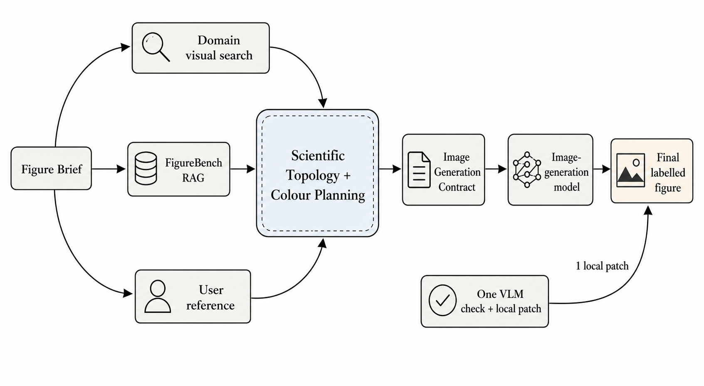
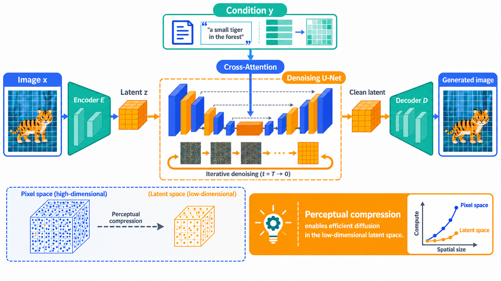
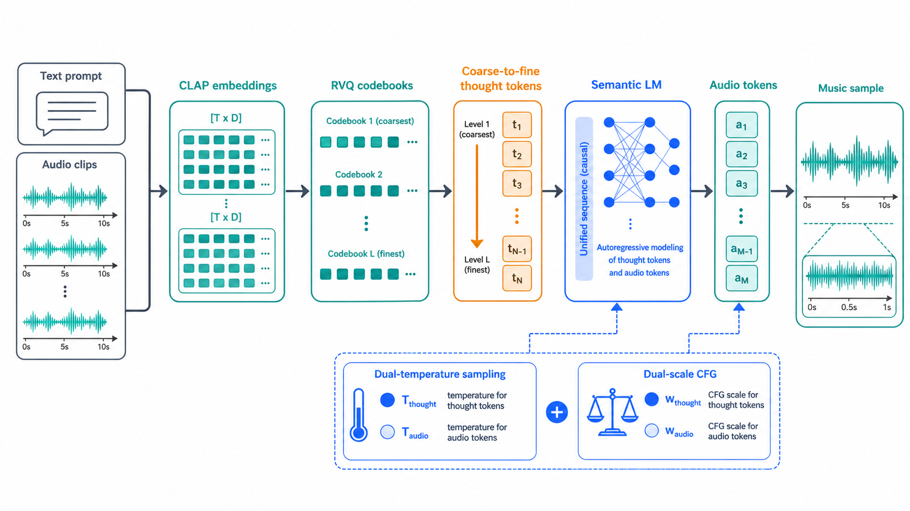
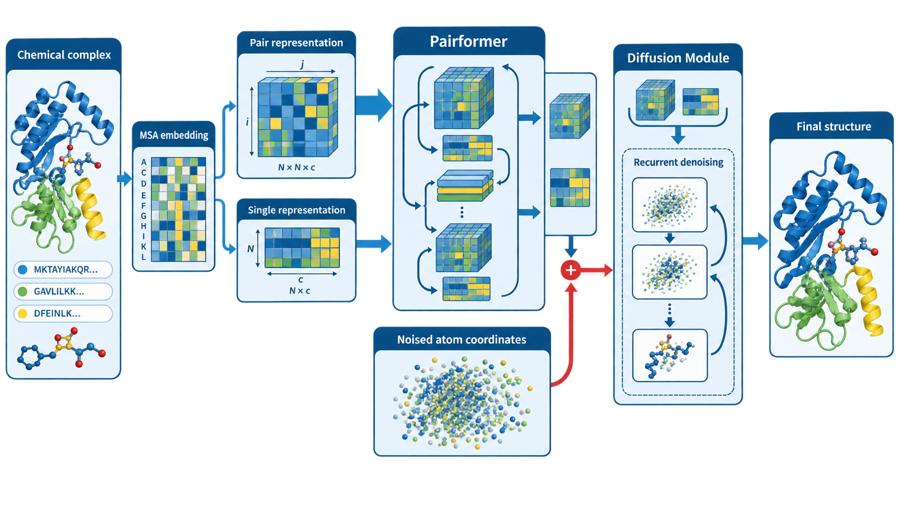

<div align="center">

# GenLikeScientificSVG

### Evidence-guided scientific figures, refined through an editable-vector diagnosis.

**Domain conventions · human-producible planning · mapped FigureBench crops · one palette lineage · final PNG2**

<p align="center">
  
  
  
  
</p>

[中文说明](./README_ZH.md) · [Workflow](#workflow) · [Reference pack](#bundled-reference-pack) · [Installation](#installation)

</div>

GenLikeScientificSVG turns a scientific Methodology and an optional reference image
into a revised, labelled architecture figure. It uses two image-generation passes
with one mandatory editable-SVG diagnostic between them. The final output is PNG2;
SVG1 is an intermediate diagnostic artifact, not the final deliverable.

## Installation

```bash
npx skills@latest add LawrenceRiver/genlike-scientific-svg-skill
```

Then provide a Methodology and, if useful, one reference image. The reference may
guide structure, layout, emphasis, and visibly human-made treatments, but it is not
a colour source.

## Workflow

```text
Methodology + optional reference
  -> Context 1: domain visual conventions
  -> Context 2: content-to-visual plan
  -> Context 3: mapped FigureBench crops + one palette lineage + taste
  -> Prompt 1 with all mapped crops -> PNG1
  -> direct base-Codex visual transcription -> editable SVG1
  -> temporary PNG1.5 -> diagnosis + approved/replacement crops
  -> Prompt 2 with PNG1 and crops, never PNG1.5
  -> final PNG2 -> stop
```

### Context 1: recurring domain visual language

The model identifies the field and screens figure panels from 3–4 scholarly papers,
preferably accessible arXiv SVG/HTML sources and otherwise credible extractable
figures. It compares actual panels and records only recurring, Methodology-relevant
objects, intermediate representations, relationships, drawing treatments,
grouping, and professional terminology. One-off treatments remain marked as such.

### Context 2: content-to-visual planning

The Methodology, Context 1, and optional reference are compressed into exact blocks,
labels, relationships, reading order, and a visual treatment for every component.
Treatments must be human-producible: basic geometry, a recurring domain convention,
a deliberate manual drawing, a draw.io-like construction, or a scientifically
necessary real photo crop. Any special visual explains why it is needed and how a
human would make it. Decorative generated-looking elements are rejected.

### Context 3: inspected construction evidence and one palette

The model inspects the pixels of at least two distinct bundled FigureBench images,
then continues adaptively until every required geometry, frame, connector, layout
relationship, and special visualization is covered. Useful regions become mapped
crops with a target component, what to borrow, what must change, and why the result
remains human-editable. Complete reference images are not dumped into Prompt 1.

Each run uses exactly one complete group from the local palette library. If that
group lacks a functional colour, only an evidenced tint, shade, tone, analogous
neighbour, compatible neutral, or controlled contrast may extend it. FigureBench,
domain figures, and the user reference never supply active palette colours. Taste
guidance is subordinate to scientific meaning, user constraints, domain evidence,
human editability, and palette lineage.

### PNG1, editable SVG1, and diagnosis

Prompt 1 contains the Methodology, Contexts 1–3, the optional reference, domain
crops, and every mapped FigureBench crop. The first image-generation pass creates
PNG1.

The base Codex multimodal model must then inspect PNG1 itself and directly transcribe
its visible labels, colours, geometry, paths, groups, lines, arrows, placement, and
relationships into editable SVG1 in one pass. This is not a redesign or a local
redraw: HTML, Python, draw.io, tracing utilities, and a single embedded-raster
wrapper are invalid substitutes. If direct editable transcription fails, the Skill
reports that failure instead of fabricating a fallback.

SVG1 is deterministically rendered to PNG1.5 solely for visual diagnosis. Each
planned component receives one verdict: `keep`, `accept_variation`, `patch`,
`reject`, or `replace`. Only qualified SVG regions and targeted replacement regions
become crops for the second prompt. PNG1.5 is never a Prompt 2 attachment.

### Final PNG2

Prompt 2 modifies PNG1 using the diagnosis, approved SVG crops, replacement crops,
and the earlier contexts. The second image-generation pass produces final PNG2 and
the workflow stops; PNG2 is not sent through another SVG loop. The deterministic
helpers validate files and provenance, but do not claim to observe model calls or
guarantee scientific correctness. Authors must verify the result before publication.

## Bundled reference pack

The installed Skill includes exactly 30 complete, indexed, attributed FigureBench
development images. They are a compact construction library for geometry, layout,
spacing, connectors, and human-edited finish. Ordinary users do not download
FigureBench: the larger dataset is only a maintainer input when curating a future
revision of the bundled pack. The Skill never uses official FigureBench test images.

## Examples

The checked-in gallery illustrates target figure classes rather than promises that
every run will reproduce the same composition:

- [Workflow](assets/runs/workflow-en.png)
- [Latent diffusion](assets/runs/latent-diffusion.png)
- [MusiCoT](assets/runs/musicot.png)
- [AlphaFold 3](assets/runs/alphafold3.png)

## Maintainers

Use `scripts/curate_figurebench_reference_pack.py` only for pack curation. Runtime
artifact validation and crop execution are exposed through
`scripts/figure_workflow.py`; installation integrity can be checked with:

```bash
python scripts/check_installation.py
```

Attributions and source metadata for all 30 bundled images are in
[`assets/figurebench-references/index.json`](assets/figurebench-references/index.json).
