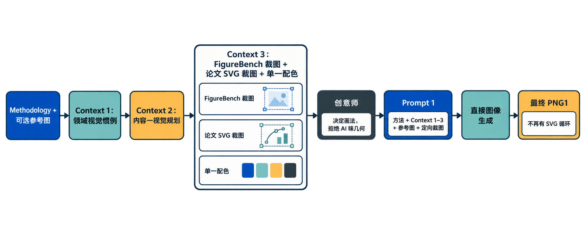
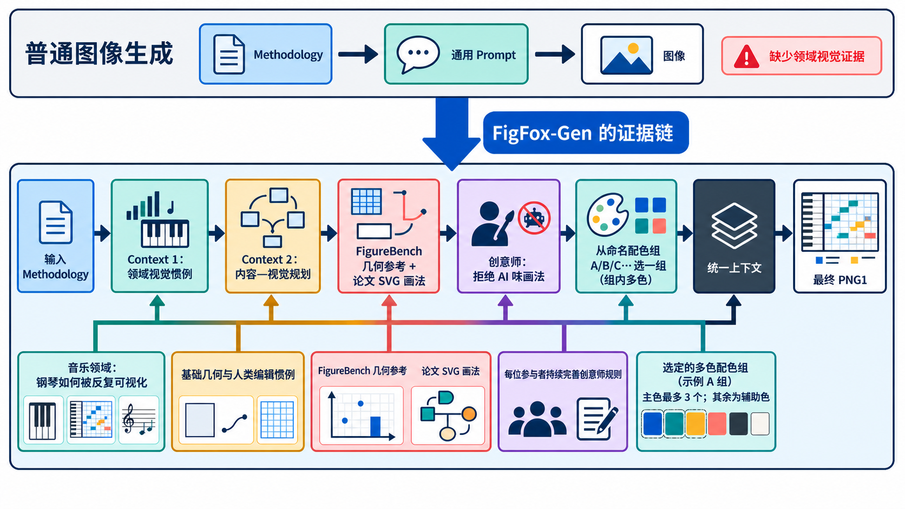

<div align="center">

# FigFox-Gen-skill

### 用可人工编辑的规划来生成有证据依据的科研图。

**领域视觉惯例 · 可人工制作的规划 · FigureBench 定向裁图 · 命名多色配色组 · 最终 PNG1**

[English](./README.md) · [流程](#工作流程) · [示例图](#已生成示例图) · [核心亮点](#figfox-gen-的核心亮点) · [内置参考包](#内置参考包) · [安装](#安装)

</div>

FigFox-Gen-skill 将 Methodology 和可选参考图转成一张带完整标签、符合人工编辑
逻辑的科研架构图。流程只进行一次图像生成，PNG1 就是最终结果。

## 已生成示例图

这是用当前 Skill 生成的中文版 FigFox-Gen 流程图。它与英文版流程同构，保留
Context 1–3、创意师、Prompt 1 和最终 PNG1 的单次生成路径。

<p align="center">
  
</p>

[查看英文版流程图](./assets/generated-figures/01-figfox-gen-workflow.png)

## FigFox-Gen 的核心亮点

真正的 Hook 是下面这条证据链：输入 Methodology 后，先找到该领域反复出现的
视觉惯例；再做内容—视觉规划；用 FigureBench 和论文 SVG 图提供几何与画法证据；
让创意师拒绝 AI 味；从命名配色组中选一组并使用组内多个颜色；最后把这些内容
合成上下文生成 PNG1。

<p align="center">
  
</p>

## 安装

```bash
npx skills@latest add LawrenceRiver/FigFox-Gen-skill
```

安装后提供 Methodology，并可按需附上一张参考图。参考图可以强力引导结构、
布局、强调方式和明显由人制作的基础视觉，但不能成为配色来源。

## 工作流程

```text
Methodology + 可选参考图
  -> Context 1：领域视觉惯例
  -> Context 2：内容—视觉规划
  -> Context 3：FigureBench 定向裁图 + 选定配色组 + Taste 软约束
  -> 创意师 Prompt -> 创意简报 + 定向论文 SVG 裁图
  -> Prompt 1（包含全部定向裁图）-> PNG1
  -> 结束
```

### Context 1：同领域反复出现的视觉语言

模型先识别领域，再筛选 3–4 篇同领域论文的实际图板；优先使用容易取得
SVG/HTML 图的 arXiv 来源，找不到时再用其他可信且可清晰提取的论文图。它比较
图板中反复出现、且与当前 Methodology 有关的对象、中间表示、结构关系、画法、
分组方式、专业术语和反复出现的主色数量。把数量记录为 `dominant_colour_count`
（1–3），只记录数量，不复制论文图的具体颜色；同时把一次性画法明确排除在
“惯例”之外。

### Context 2：内容—视觉规划

模型结合 Methodology、Context 1 和可选参考图，把方法压缩成精确模块、标签、
关系、阅读顺序，并给每个内容指定视觉表达。普通表达必须能由人制作：基础几何、
领域论文中反复出现的画法、刻意的手绘、draw.io 式可编辑结构，或科学含义确实
需要的真实照片切图。特殊表达要解释其必要性，以及人会用几何、手写笔还是现实
照片来制作；无语义的生成式装饰直接否决。

### Context 3：实际像素参考与命名配色组

模型必须查看至少两张不同的内置 FigureBench 完整图片，并继续自适应查看，直到
Context 2 所需的几何、框架、连接方式、布局关系和特殊可视化都被覆盖。可用区域
会变成与目标构件绑定的裁图合同，写清借鉴什么、必须改变什么，以及为何仍像人可
编辑的变体。完整候选图不会被无解释地塞进 Prompt 1。

本地颜色库保存了每一套命名配色组；`palettes` 数组中的每一条记录就是一组，
每组都有多个带角色的颜色，不是单个颜色。
每次运行选择一组，并可以使用该组中的多个颜色；这不是单色或黑白化约束。如果
功能角色不够，只能通过有网页证据的 tint、shade、tone、邻近色、兼容中性色或受控
对比色补充。FigureBench、同领域论文图和用户参考图都不能提供实际使用的颜色。
Taste 只负责配色平衡、留白、层级、节奏和克制感，并服从科学含义、用户约束、领域
证据、人工可编辑性与选定的配色组谱系。最终图的主色最多三种，并且数量必须与
Context 1 观察到的数量一致；其余颜色只能作为中性、浅色、阴影或辅助角色，不能
形成第四个主色。

### 创意师：PNG1 前的视觉构思

Context 1–3 完成后，先运行一次有边界的创意师 Prompt。它只能为已经规划的构件
提出具体画法，不能生成 PNG1，也不能重画整张图。如果突然需要 Context 1–3 尚未
覆盖的成熟画法，创意师必须找到真实论文中可用 SVG 或可提取 SVG/HTML 的图，查看
像素后，只裁出目标局部，放在
`references/web/crops/creative-director/`。每个裁图必须记录目标构件、HTTPS
`source_url` 和 `evidence_url`、`source_format: "svg"`、`borrow`、`must_change`
以及为何仍可由人编辑。不能伪造来源、不能附整张论文图，也不能使用贴纸式切图。
如果不需要新的外部画法，必须明确返回 `no_external_svg_needed`。

```bash
python scripts/figure_workflow.py build-creative-director-prompt --run RUN
python scripts/figure_workflow.py validate-creative-director --run RUN
```

### Prompt 1 与最终 PNG1

Prompt 1 同时包含 Methodology、Contexts 1–3、创意师简报、可选参考图、论文裁图、
所有定向 FigureBench 裁图，以及创意师批准的论文 SVG 裁图。唯一一次图像生成得到
PNG1。论文 SVG 裁图只能指导声明的构件，不能带入来源标签、配色、比例或整张图的
构图。

PNG1 有两条绝对禁令：任何模块都不能把上半段用横线框出来做成居中的标题栏，不能
使用截图中那种“标题条 + 内容框”结构；也不能直接贴入贴纸式切图、剪贴画、徽章、
勋章、印章或栅格徽章。需要的科学对象必须用可编辑几何表达；只有科学上确有必要、
并在 Context 2 明确记录的真实照片才能作为特殊视觉。

图像模型只接收一次 `prompt-1/prompt.md` 和全部清单附件，生成一张完整、有标签、
符合人工编辑逻辑的图。PNG1 是本 Skill 的最终交付物；之后不再转换或再次生成。
正式使用前仍需作者检查 PNG1。

## Methodology 案例原文

英文 README 的 [Recorded methodology cases](./README.md#recorded-methodology-cases)
保留了 Latent Diffusion、MusiCoT 和 AlphaFold 3 三组案例的完整 Methodology
原文；这里不再用简版关键词替代原文。三组案例对应的示例图见英文 README 的
[Generated figure examples](./README.md#generated-figure-examples)。

## 内置参考包

Skill 随安装包提供恰好 30 张完整、已索引且有署名信息的 FigureBench 开发集图片，
用于参考几何、布局、间距、连接方式和人工编辑质感。普通用户无需下载 FigureBench；
完整数据集只在维护者重新策划这 30 张内置图片时使用，并且绝不使用官方测试集图片。

## 维护者说明

`scripts/curate_figurebench_reference_pack.py` 只用于维护参考包；运行时的验证和裁图
由 `scripts/figure_workflow.py` 提供。安装完整性可以这样检查：

```bash
python scripts/check_installation.py
```

30 张内置图片的署名和来源信息记录在
[`assets/figurebench-references/index.json`](assets/figurebench-references/index.json)。
