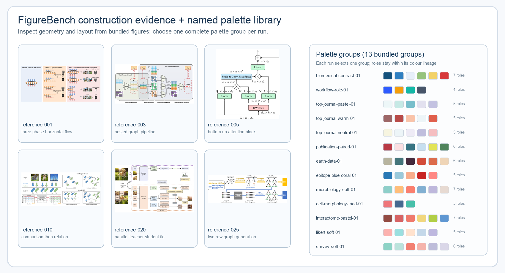

<div align="center">

# FigFox-Gen-skill

### 用有证据的视觉规划生成符合人工编辑逻辑的科研图。

**领域视觉惯例 · 内容—视觉规划 · FigureBench 证据 · 命名多色配色组 · 最终 PNG1**

[English](./README.md) · [安装](#安装) · [工作流程](#工作流程) · [实测结果](#实测结果) · [内置参考包](#内置参考包)

</div>

FigFox-Gen-skill 将 Methodology 和可选参考图转成一张带完整标签、符合人工编辑
逻辑的科研架构图。它先把视觉决策写清楚，再进行唯一一次图像生成，交付 PNG1
供作者检查。

## 流程概览

两张总览图故意采用不同构图：英文版是横向证据链，中文版是带两侧证据分支的
自上而下主轴。

<div align="center">
  <table>
    <tr>
      <td width="72%" valign="top"></td>
      <td width="28%" valign="top"></td>
    </tr>
  </table>
</div>

## 安装

```bash
npx skills@latest add LawrenceRiver/FigFox-Gen-skill
```

安装后提供 Methodology，并可按需附上一张参考图。用户参考图是严格的视觉样本：
在 Methodology 允许的范围内匹配它的构图、间距、层级、线宽、圆角、填充、文字
尺度、箭头语法和 sample 处理；不能擅自美化、复杂化、换风格或重排。它不能成为
实际配色来源。安装完整性可以这样检查：

```bash
python scripts/check_installation.py
```

## 工作流程

上面的左右两栏已经展示完整主路径；下面用文字复述同一顺序，并解释配色库和
FigureBench 的构件证据，不再重复放图。

```text
Methodology + 可选参考图
  -> Context 1：领域视觉惯例
  -> Context 2：内容—视觉规划
  -> Context 3：FigureBench 定向裁图 + 选定一套配色组
  -> 创意师简报 + 必要时的定向论文 SVG 裁图
  -> Prompt 1（包含全部映射裁图）-> PNG1
  -> 结束
```

### FigureBench 与配色库预览

FigureBench 是本地的构件参考库，不是配色来源。模型至少查看两张不同的内置图片，
并继续查看到当前图所需的框架、连接、基础几何、布局关系和特殊可视化都有证据。
颜色库保存命名配色组；每次运行只从其中随机选一套，但可以使用组内多个带角色的
颜色。下面的组合图展示了几何证据和当前内置的 13 套配色组。

<p align="center">
  
</p>

## 实测结果

下面横向对比三个 Methodology 案例：第一列是 Methodology，第二列是生成效果。
完整的原文输入保留在 [Methodology 原文](#methodology-原文) 中。

| Methodology | 生成效果 |
|---|---|
| **Latent Diffusion**<br>[Rombach et al.](https://arxiv.org/abs/2112.10752)<br>图像空间 → 潜空间 → 去噪 U-Net → 生成图像 |  |
| **MusiCoT**<br>[MusiCoT](https://arxiv.org/abs/2503.19611)<br>文本/音频输入 → CLAP/RVQ 思维 token → 语义 LM → 音乐样本 |  |
| **AlphaFold 3**<br>[Abramson et al.](https://www.nature.com/articles/s41586-024-07487-w)<br>化学复合物 → Pairformer/扩散模块 → 最终结构 |  |

## 完整规范

### Context 1：同领域反复出现的视觉语言

模型先识别领域，再筛选 3–4 篇同领域论文的实际图板；优先使用容易取得 SVG/HTML
图的 arXiv 来源，找不到时再用其他可信且可清晰提取的论文图。第一张选定的代表性
论文图先确定可见的主色数量，记录为 `dominant_colour_count`（1–3）；后续论文用于
核对这个数量和反复出现的对象、中间表示、结构关系、画法、分组方式与专业术语。
只记录数量，不复制论文图的具体颜色；一次性画法要明确标出并排除在惯例之外。

### Context 2：内容—视觉规划

模型结合 Methodology、Context 1 和可选参考图，把方法压缩成精确模块、标签、
关系、阅读顺序，并给每个内容指定视觉表达。普通表达必须能由人制作：基础几何、
领域论文中反复出现的画法、刻意的手绘、draw.io 式可编辑结构，或科学含义确实
需要的真实照片切图。特殊表达要解释其必要性，以及人会用几何、手写笔还是现实
照片来制作；无语义的生成式装饰直接否决。

创意师必须按人类使用编辑器的顺序规划：先选画布和底座几何，再搭建有语义的
结构，之后画朴素清晰的箭头，再放精简且准确的文字，最后把解释性配图放在文字
下方或旁边。输入优先使用真实或明确记录的 sample；拓扑、网格、模型结构等已有
成熟画法时，优先找论文 SVG/HTML 的定向构件作为证据，不凭空画假的拓扑。规则网格
必须保持整齐，几何块使用纯色或单一受控填充，箭头保持从属而不抢主体；只有规划
好的底座形状可以使用轻微、单一的变色过渡，几何块内部或装饰性的渐变直接否决。

### Context 3：实际像素参考与命名配色组

模型必须查看至少两张不同的内置 FigureBench 完整图片，并继续自适应查看，直到
Context 2 所需的几何、框架、连接方式、布局关系和特殊可视化都被覆盖。可用区域
会变成与目标构件绑定的裁图合同，写清借鉴什么、必须改变什么，以及为何仍像人可
编辑的变体。完整候选图不会被无解释地塞进 Prompt 1。

本地颜色库保存了每一套命名配色组；`palettes` 数组中的每条记录就是一组，每组
都有多个带角色的颜色。每次运行随机选择一组，并可以使用该组中的多个颜色：

```bash
python scripts/figure_workflow.py select-palette --run RUN
python scripts/figure_workflow.py select-palette --run RUN --seed SEED  # 可复现
```

这不是单色或黑白化约束。如果功能角色不够，只能通过有证据的 tint、shade、tone、
邻近色、兼容中性色或受控对比色补充。FigureBench、同领域论文图和用户参考图都
不能提供实际使用的颜色。Taste 只负责配色平衡、留白、层级、节奏和克制感，并服从
科学含义、用户约束、领域证据、人工可编辑性与选定的配色组谱系。最终图的主色最多
三种，并且数量必须与 Context 1 观察到的数量一致；其余颜色只能作为中性、浅色、
阴影或辅助角色，不能形成第四个主色。

### 创意师：PNG1 前的视觉构思

Context 1–3 完成后，先运行一次有边界的创意师 Prompt。它只能为已经规划的构件
提出具体画法，不能生成 PNG1，也不能重画整张图。如果突然需要尚未覆盖的成熟画法，
创意师必须找到真实论文中可用 SVG 或可提取 SVG/HTML 的图，查看像素后，只裁出
目标局部，放在 `references/web/crops/creative-director/`。每个裁图记录目标构件、
HTTPS `source_url` 和 `evidence_url`、`source_format: "svg"`、`borrow`、
`must_change` 以及为何仍可由人编辑。不能伪造来源、不能附整张论文图、不能使用
贴纸式切图。如果不需要新的外部画法，必须明确返回 `no_external_svg_needed`。

```bash
python scripts/figure_workflow.py build-creative-director-prompt --run RUN
python scripts/figure_workflow.py validate-creative-director --run RUN
```

### Prompt 1 与最终 PNG1

Prompt 1 同时包含 Methodology、Contexts 1–3、创意师简报、可选参考图、论文裁图、
所有定向 FigureBench 裁图，以及创意师批准的论文 SVG 裁图。唯一一次图像生成得到
PNG1。论文 SVG 裁图只能指导声明的构件，不能带入来源标签、配色、比例或整张图的
构图。

PNG1 有两条绝对禁令：任何模块都不能把上半段用横线框出来做成居中的标题栏，不能
使用截图中那种“标题条 + 内容框”结构；也不能直接贴入贴纸式切图、剪贴画、徽章、
勋章、印章或栅格徽章。需要的科学对象必须用可编辑几何表达；只有科学上确有必要、
并在 Context 2 明确记录的真实照片才能作为特殊视觉。

图像模型只接收一次 `prompt-1/prompt.md` 和全部清单附件，生成一张完整、有标签、
符合人工编辑逻辑的图。PNG1 是本 Skill 的最终交付物；之后不再转换或再次生成。
正式使用前仍需作者检查 PNG1。

## Methodology 原文

英文 README 的 [Full Methodology inputs](./README.md#full-methodology-inputs) 保留了
Latent Diffusion、MusiCoT 和 AlphaFold 3 三组案例的完整 Methodology 原文；这里不
用简版关键词替代原文。三组案例对应的示例图已在上面的横向实测表中展示。

## 内置参考包

Skill 随安装包提供恰好 30 张完整、已索引且有署名信息的 FigureBench 开发集图片，
用于参考几何、布局、间距、连接方式和人工编辑质感。普通用户无需下载 FigureBench；
完整数据集只在维护者重新策划这 30 张内置图片时使用，并且绝不使用
官方测试集图片。

30 张内置图片的署名和来源信息记录在
[`assets/figurebench-references/index.json`](assets/figurebench-references/index.json)。

## 维护者说明

`scripts/curate_figurebench_reference_pack.py` 只用于维护参考包；运行时的验证和裁图
由 `scripts/figure_workflow.py` 提供。

```bash
python scripts/check_installation.py
```
