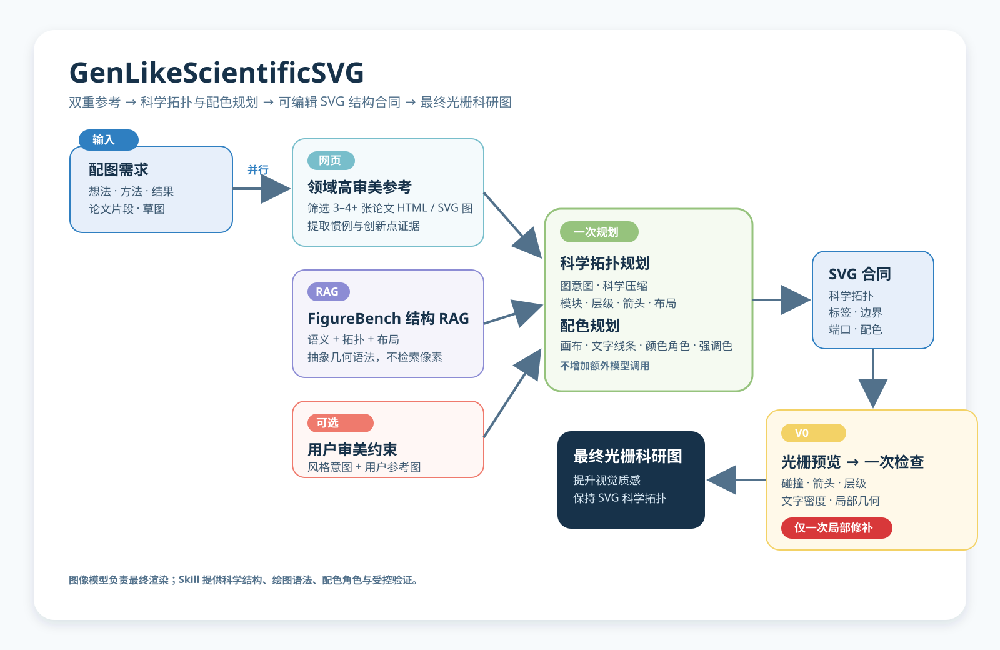

<div align="center">

# GenLikeScientificSVG

### 让智能体拥有科研论文图的绘图语法。

**双重参考 RAG · 审美配色系统 · 可编辑 SVG 结构**

[English](./README.md) · [工作流程](#工作流程) · [安装](#安装) · [研究说明](#研究说明)

</div>



## 这是什么

GenLikeScientificSVG 是面向科研论文图生成的智能体 Skill。输入可以是想法、方法、结果、论文片段、草图或参考图。它可用于 Codex、Claude Code、DeepSeek Harness，以及其他能够加载 `SKILL.md` 与相邻文件的智能体。

它不替代最终图像模型，而是先把科研图应有的科学关系、绘图惯例、审美配色和可编辑 SVG 结构交给图像模型，再进行最终渲染。

## 工作流程

| 阶段 | 明确产出 |
| --- | --- |
| 领域高审美参考 | 筛选至少 3–4 张相关论文 HTML/SVG 图，检查构图、层级、构件惯例、留白、色彩关系与科研感；提取领域绘图惯例，以及用户方法相较常见做法的证据。 |
| FigureBench 语义–结构 RAG | 检索方法语义、图类型、拓扑、布局、分组、文字密度和抽象几何语法；不是像素相似图检索。 |
| 科学拓扑与配色规划 | 压缩冗余文字；确定模块、箭头、层级、布局、标签、画布、文字线条、颜色角色和唯一强调色。该步骤内联完成，不增加模型调用。 |
| SVG 结构合同 | 以可编辑 SVG 锁定科学拓扑、模块语义、标签边界、箭头端点、层级、分组与颜色角色。 |
| 一次受控检查 | 得到 V0 光栅预览后，只检查碰撞、箭头、层级、文字边界、密度、留白和局部几何，并且只允许一次局部 SVG 修补。 |
| 最终光栅图 | 图像模型可以提升科学资产与视觉质感，但必须保留 SVG 的科学关系、标签、箭头和主要结构。 |

## 最终图像模型实际获得什么

- 来自高审美领域论文图的绘图惯例；
- FigureBench 的语义–结构摘要，而不是完整数据集；
- 将常规做法与用户方法创新点区分开的科学拓扑规划；
- 来自纯 HEX/RGB 色组库的颜色角色分配；
- 明确的 SVG 模块边界、标签、端口、箭头方向、层级和阅读顺序；
- 一份只允许局部修补、不能整图重设计的检查说明。

这套约束旨在减少科研图常见问题：科学关系被改写、标签不可读、颜色任意、箭头断裂，以及像普通 PPT 的布局。它是一套结构化流程，不是“任何情况下都绝对正确”的性能承诺。

## 安装

克隆后请保留目录结构：`SKILL.md` 会引用同目录的 `references/`、`scripts/` 与 `scientific_figure_rag/`。

```bash
git clone https://github.com/LawrenceRiver/genlike-scientific-svg-skill.git
```

| 智能体 | 加载方式 |
| --- | --- |
| Codex | 将仓库目录复制或软链接到 `~/.codex/skills/genlike-scientific-svg`。 |
| Claude Code | 以项目 Skill 的形式加入仓库目录，并保留目录结构。 |
| DeepSeek Harness / 其他智能体 | 将 `SKILL.md` 作为工作流指令加载，并保留相邻文件，使其可读取参考说明与辅助脚本。 |

## 配色系统

配色 RAG 只保存成组的 HEX/RGB 色号、颜色角色和检索标签；不保存色卡截图、原图 URL、图片路径或图片 embedding。

```bash
python scripts/figurebench_rag.py palettes --planning-json colour-plan.json --top-k 3
```

它会选择少量候选色组，并在规划中明确画布、文字线条、容器、语义模块、比较色与唯一强调色。详见 [Palette RAG](./references/palette-rag.md)。

## 可选的 FigureBench RAG

FigureBench 仅用于维护者本地的语义–结构参考；普通用户不需要下载完整数据集。公开版本绝不上传原始图片、本地 SQLite 索引、语料文本或本地路径。索引或导出前请阅读 [FigureBench RAG](./references/figurebench-rag.md)。

## 研究说明

我是一名从事计算机视觉学习与研究的学生，目前关注科研论文图生成。我希望研究：当智能体或 VLM 获得明确的参考证据、科学拓扑、布局与配色约束，而不只是一段文字 prompt 时，它能在多大程度上可靠地理解配图需求，并对最终视觉呈现保持可控。

这是一个开放研究工具。任何由它生成的概念图都不应直接替代实验事实；论文中的科学内容仍需由作者独立核验。

## 仓库结构

- `SKILL.md`：主工作流
- `assets/architecture/`：可编辑的中英文流程 SVG
- `references/`：配色与 FigureBench RAG 说明
- `scientific_figure_rag/`：本地语义–结构与配色检索模块
- `scripts/`：索引、检索和安全导出命令
- `tests/`：检索与文档测试
