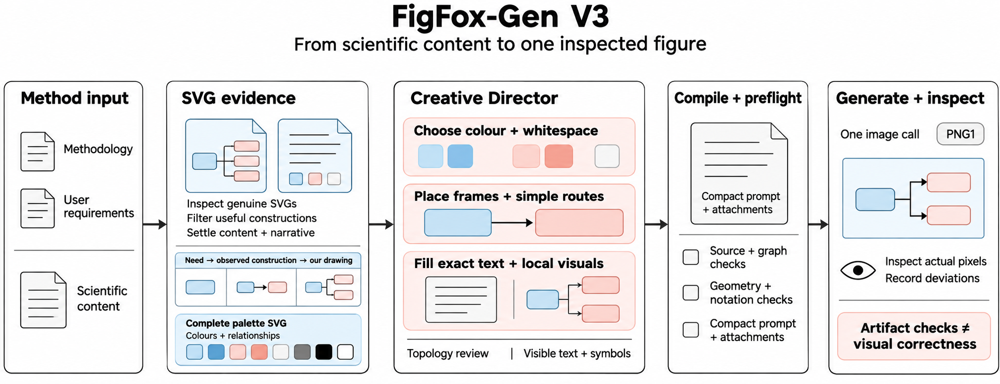

> Active workflow: SVG-only references, dedicated complete other-track SVG palette, full Creative Director colour/layout decisions, and simple routes. See [SKILL.md](SKILL.md). Fixed-library and regular-rectangle examples below are historical, not new-run mandates.

<div align="center">

# FigFox-Gen-skill · V3

### 从 Methodology 和真实证据出发，生成一张科研图。

**同类图需求锚点 · 按需配图 · 有范围的风格借鉴 · SVG 来源配色 · 最终 PNG1**

[English](./README.md) · [安装](#安装) · [工作流程](#工作流程) · [案例](#案例) · [版本说明](references/versions.md)

</div>

## V3 · SVG-reference workflow / SVG 参考流程



[Full V3 Methodology / 完整方法正文](examples/v3.1/architecture/input/methodology.md) · [Generated with our own skill / 自己的 skill 生成记录](examples/v3.1/architecture/README.md) · [Prompt / 提示词](examples/v3.1/architecture/prompt-1/prompt.md)

Current version: **V3 (`v3.1.0`)**. / 当前版本：**V3 (`v3.1.0`)**。

- Inspect genuine vector SVG references and retain source provenance; report missing references rather than substitute raster images.
- Derive colours and their spatial relationships from one complete SVG; the Creative Director decides the final palette, composition and scientific detail.
- Place frames and plan straight or single smooth-curve routes together. Preserve genuine internal topology and keep text inside its parent region.
- Generate one PNG1 and inspect the actual image. Deterministic validation does not certify scientific or visual correctness.

真实 SVG 参考与来源记录 → 方法内容与叙事 → 完整 SVG 配色关系 → 创意师统筹配色、布局与真实内部拓扑 → 简单连线 → 单次 PNG1 → 实际图像检查。

See [the active workflow and schemas](references/svg-reference-workflow.md) and [SKILL.md](SKILL.md). Historical raster-library runs remain replayable; new runs use `svg-reference-v1`.

## Historical V2 architecture / 历史 V2 架构

The overview and V2 notes below document the previous workflow; they are retained for provenance and do not define V3 defaults. / 以下总览与 V2 说明保留历史来源，不代表 V3 默认流程。


Historical V2 workflow, generated with FigFox-Gen and reconstructed as editable SVG with FigFox. / 历史 V2 流程示例。


[Methodology & generation record / 方法正文与生成记录](examples/v2-architecture/README.md)

[Editable SVG / 可编辑 SVG](assets/generated-figures/figfox-gen-v2-architecture-editable.svg) · [SVG preview / SVG 渲染预览](assets/generated-figures/figfox-gen-v2-architecture-editable.png) · [Source comparison & editability / 原图对照与可编辑性](examples/v2-architecture/editable/README.md)

此前 V2 的发布版本为 `v2.1.0`。它从科学 Methodology 出发，形成
有来源依据的绘图计划，交付一张栅格 PNG1。细节服务于方法的实际创新，辅助模块保持
一致层级；复用已核实的缓存，按视觉需求并行处理构件证据、参考特征与配色，再由
创意师确定完整矩形布局和精确连线几何。

默认视觉优先级为：完整矩形整体、规整分区、在框内尽可能单向传导。以白底、黑字和浅色为主；只对重要内容定向着色，普通支撑区域尽量留白。

V2 按所需粒度采用标准模型的经典结构画法，默认在普通背景上使用粗体标题，把
颜色重点留给科学内容；箭头采用统一的比例与风格，可使用粗杆、圆角或手绘线条。
按需选用且已获使用许可的内容插图，通过确定性贴入保留实际素材像素。只调用一次
图像模型生成布局；生成图或贴入素材后的合成图就是唯一最终 PNG1，由作者检查实际
像素后决定是否接受，不承诺可编辑 SVG。

查看 [此前的预览案例与检查记录](examples/v3-0-1/README.md)、此前的
[布局和连线对照](examples/regular-layout-trial/README.md)，以及
[直接视觉插图合同](references/direct-visual-insets.md)。旧的独立 V2 入口已移除，此前流程统一为默认 V2；V1 仍可通过 `$figfox-gen-v1` 明确调用。

## From generated figure to editable SVG / 从生成图到可编辑 SVG

After choosing a generated PNG, use the separate [FigFox skill](https://github.com/LawrenceRiver/FigFox#use-as-a-skill--作为-skill-使用) to reconstruct it as an editable SVG. Text, shapes and connectors remain native, while photos can be independently movable image elements.

生成 PNG 后，可调用独立的 [FigFox skill](https://github.com/LawrenceRiver/FigFox/tree/main/skills/figfox)，还原为可编辑 SVG：文字、图形、箭头保持原生元素，照片可独立移动与替换。

```bash
npx skills@latest add LawrenceRiver/FigFox --skill figfox
```

Use `$FigFox-Gen-skill` to create the figure, then `$figfox` to reconstruct the selected image; conversion is explicitly invoked rather than an automatic generation/repair loop.

先用 `$FigFox-Gen-skill` 生成，再用 `$figfox` 还原选定图片；两步分别调用，不自动进入重建或修图循环。

[Installation & workflow / 安装与流程](https://github.com/LawrenceRiver/FigFox/blob/main/docs/skill.md) · [Our editable V2 example / 本仓库 V2 可编辑示例](examples/v2-architecture/editable/README.md)

## 历史 V2 更新亮点

1. **不再出现过度配色的 Mermaid 式拓扑图。** 用主视觉参考统一图形、箭头和字体，让生成结果具有真正科研架构图的构造感。
2. **真正从简的逻辑布局。** 支持反 C、S 型和环形等排布，整体规整、饱满、对齐，尽可能单向传导，并逐条复查实际箭头的逻辑走向。
3. **反直觉的空间配色要求。** 相邻模块用相近浅色过渡，远处才拉开色彩差异，关键机制通常只保留一种强调色。
4. **图片插入开挂。** 音频波形、街景等外部图片可以按科学需要直接嵌入框架图，让具体内容进入方法表达。
5. **专家式文字压缩。** 默认靠近 100 词，删除重复解释和灰色微字，并参考同类论文的创新粒度决定自己的细节展开程度，框架创新讲框架、层级创新讲层级，用户可按需求调整。

## Examples · V3 / V3 新案例

Complete updated Methodology inputs and recorded checks are linked below. / 以下包含更新后的完整 Methodology 与实际检查记录。

### Qwen-Music


[Full Methodology / 完整方法正文](examples/v3.1/qwen-music/input/methodology.md) · [Prompt, sources & inspection / 提示词、来源与检查](examples/v3.1/qwen-music/README.md)

Known deviations: external connector prose and incomplete internal melody continuation. / 已记录：连线说明出框，旋律到语义输出连接仍不完整。

### AlphaGenome


[Full Methodology / 完整方法正文](examples/v3.1/alphagenome/input/methodology.md) · [Prompt, sources & inspection / 提示词、来源与检查](examples/v3.1/alphagenome/README.md)

Known deviation: some connector labels remain outside frames. Readouts are schematic. / 已记录：少量连线标签出框；读出均为示意。

### World Models · MDN-RNN


[Full Methodology / 完整方法正文](examples/v3.1/world-models/input/methodology.md) · [Prompt, sources & inspection / 提示词、来源与检查](examples/v3.1/world-models/README.md)

Known deviation: mild shading/gradients. / 已记录：局部有轻微渐变。

[All V3 run packages / 全部 V3 运行记录](examples/v3.1/README.md) · [Historical preview cases / 历史预览案例](examples/v3-0-1/README.md)

### 可选科研海报支线

[PosFox Gen](skills/posfox-gen/SKILL.md) 已作为附加 Skill 收进本仓库。**只有用户明确要求制作科研海报或学术海报时才进入这条支线**；论文 PDF、大幅面参考、提及或否定海报都不构成触发条件。其余仍按科研论文图、方法图或架构图处理。

也可以只安装海报生成附加包：

```bash
npx skills@latest add LawrenceRiver/FigFox-Gen-skill --full-depth --skill posfox-gen
```

明确要求 `$posfox-gen` 制作科研海报，并提供论文 PDF 与可选参考。它在生成 PNG 后结束，不自动进入 HTML/SVG 重建，也不需要旧的独立生成仓库。

## 安装

[skills CLI](https://github.com/vercel-labs/skills) 需要 Node.js 22.20 或以上。
安装默认版本，并在提示中选择 Codex：

```bash
npx skills@latest add LawrenceRiver/FigFox-Gen-skill --skill FigFox-Gen-skill
```

默认安装到当前项目；加 `-g` 可用于所有项目，加 `-a codex` 可直接选择 Codex。
已经安装的副本需要主动更新：

```bash
npx skills@latest check
npx skills@latest update FigFox-Gen-skill
```

远端仓库更新不会自动改动本地安装。手动安装或固定在 V1 的副本，可用上面的 V2
安装命令切换来源；先保存本地自定义修改。固定版本与 V1/V2 共存方法见
[版本说明](references/versions.md)。在已安装的 Skill 目录检查文件完整性：

```bash
python scripts/check_installation.py
```

使用时提供 Methodology，可选附上参考图。一般请求默认使用 V2；保留的旧版名为
`figfox-gen-v1`，只在明确指定它时调用。

## 工作流程

```text
Methodology + 用户要求
  → 真实 SVG 证据 + 已确定的科学内容与叙事
  → 创意师：配色与留白 → 框架与简单连线 → 准确文字与局部构造
  → 来源/科学关系/几何/符号预检 → 紧凑图像提示词
  → 一次图像调用 → PNG1 → 实际像素检查 + 偏差记录
```

1. **先确定科学内容。** Methodology 决定模块、依赖关系与贡献。优先检查真实 SVG 论文图，只保留有用构造，记录参考缺口及需求—观察画法—本图表达的对应关系。
2. **收集完整风格与配色证据。** 从另一赛道的一张完整 SVG 中记录真实色值、相邻和分离关系、强调与留白。新流程不从固定色板库选配色；本地 PNG 只作为原 SVG 的显示或传输衍生图。
3. **创意师统筹决策。** 创意师结合方法内容与完整参考，先决定来源配色及衍生色，再共同安排内容大小合适的框架与简单走线，最后填入准确文字、符号和局部构造。保留真实内部拓扑；普通框通常一个输入和一个输出，必要多端口须有科学依据。
4. **编译与预检。** 检查 SVG 与哈希、来源配色决策、科学关系、符号及几何。路径只用直线或必要的单条简单曲线；复杂绕线通过移动或重组框架解决。将科学不变量、构造要求和实际参考附件编译为紧凑提示词。
5. **单次生成与实际检查。** 调用一次图像模型，交付 PNG1，检查真实图像，保留方法正文、来源、创意决策、计划、提示词与已知偏差。产物校验不能证明视觉或科学正确，不自动修图或还原可编辑 SVG。

[完整 V3 Methodology](examples/v3.1/architecture/input/methodology.md) · [当前 skill](SKILL.md) · [SVG 合同](references/svg-reference-workflow.md) · [紧凑交付](references/compact-generation.md)

## 历史 V1 案例

旧图与原路径保持不变，作为 V1 案例；历史配色预览展示的是旧版颜色库。

| V1 Methodology | 原 V1 结果 |
|---|---|
| Latent Diffusion |  |
| MusiCoT |  |
| AlphaFold 3 |  |

[V1 FigureBench/配色预览](assets/figurebench-palette-preview.png)

## 内置参考包

安装包内有恰好 30 张完整、已索引且有署名的 FigureBench 开发集图片，以及
**14 组命名配色**。普通用户无需下载 FigureBench；不使用官方测试集图片。
FigureBench 提供几何与布局证据，不提供实际配色；FigFoxBench 是另一个独立来源。
署名信息见 [图片索引](assets/figurebench-references/index.json)。来源可访问或属于
某数据集并不等于允许重新分发；用户图片和权限未确定的素材留在本地。

## 维护者

`scripts/curate_figurebench_reference_pack.py` 用于维护参考包，
`scripts/figure_workflow.py` 用于运行产物和验证。

```bash
python scripts/check_installation.py
python -m unittest discover -s tests -v
```

检查通过不能替代像素目检。固定安装、迁移与旧版保留策略见
[版本说明](references/versions.md)。
